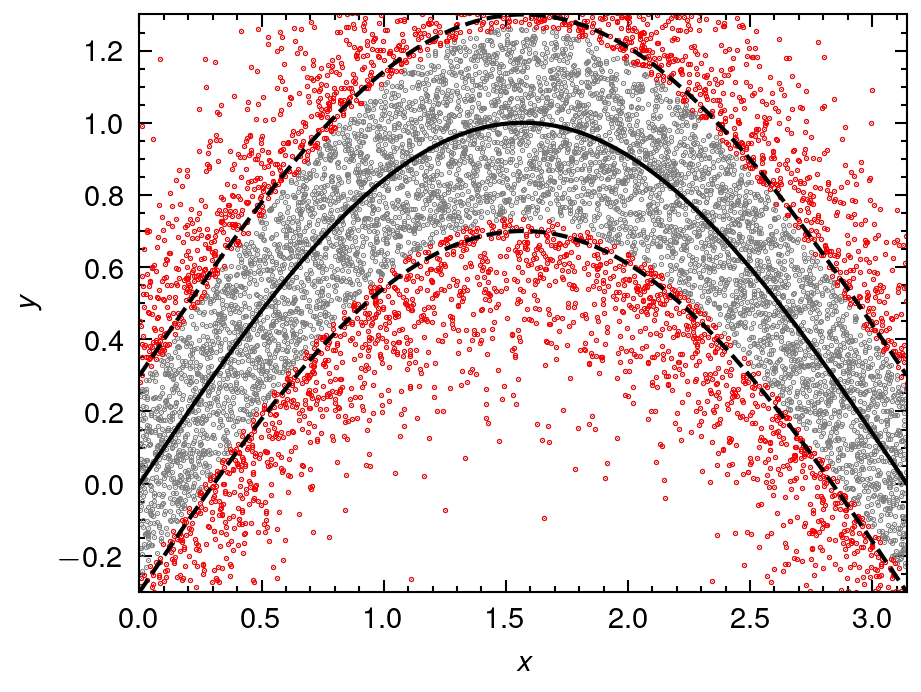
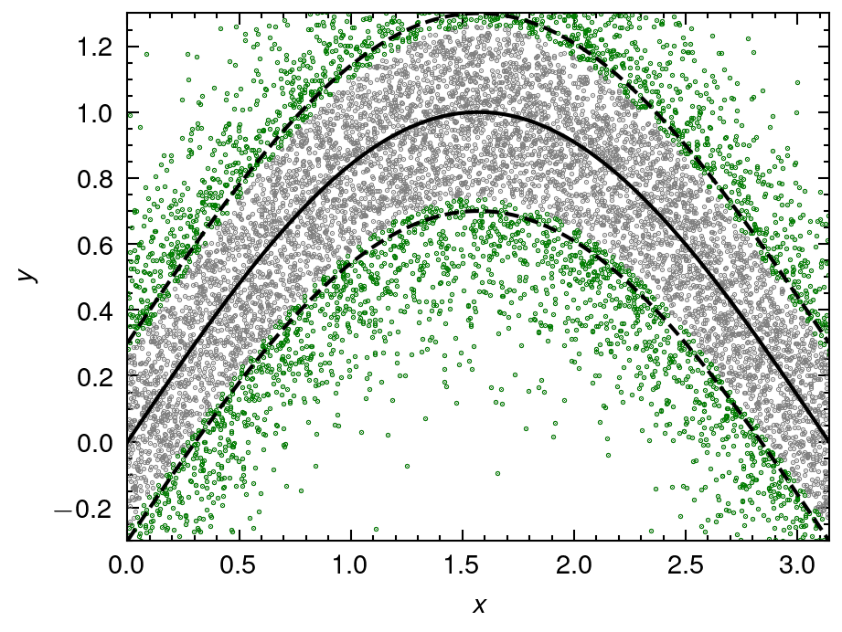
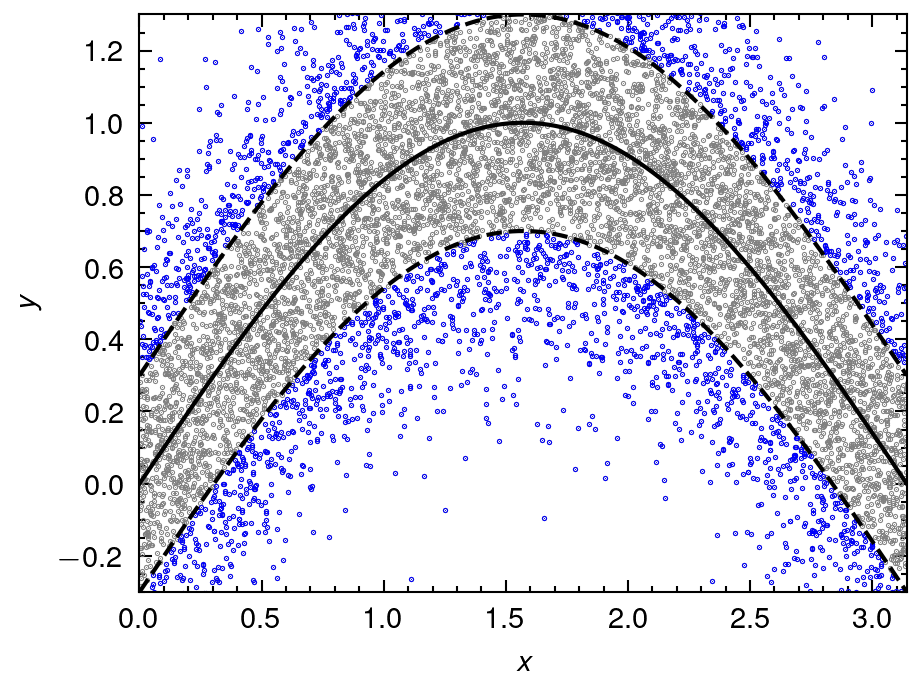
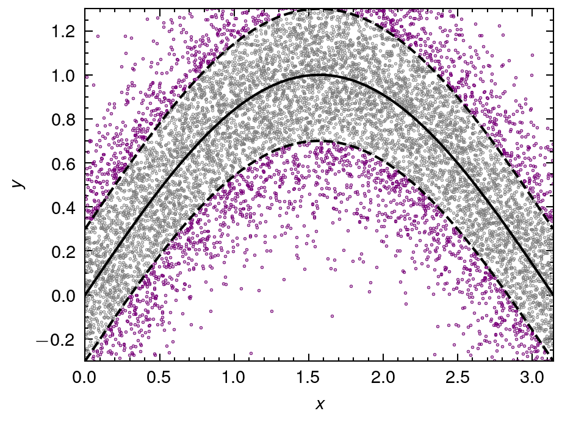

# Thresholding method for Anomaly detection

## 3-sigma rule for L1 error

## 3-sigma rule using Trimmed mean and std for L1 error

## 3-sigma rule for signed L1 error

## 3-sigma rule using Trimmed mean and std for signed L1 error

